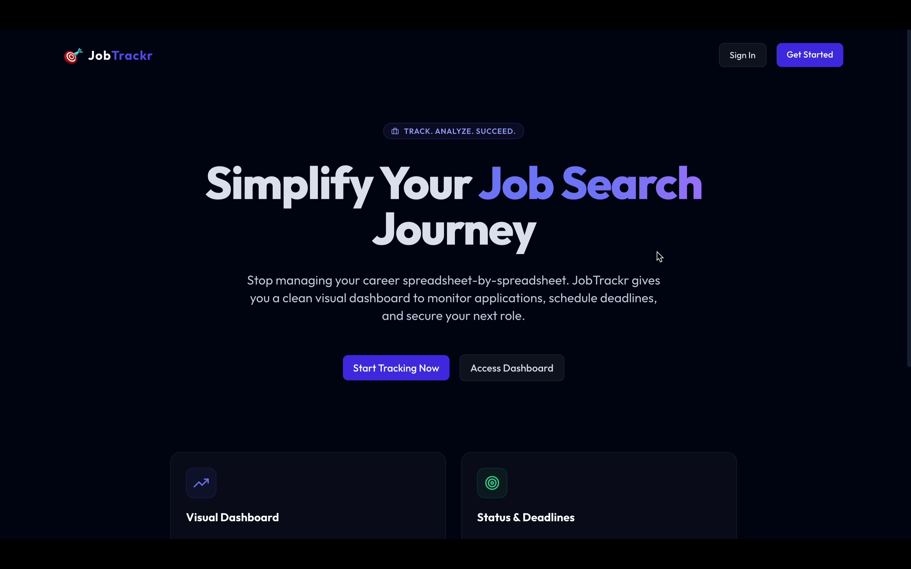
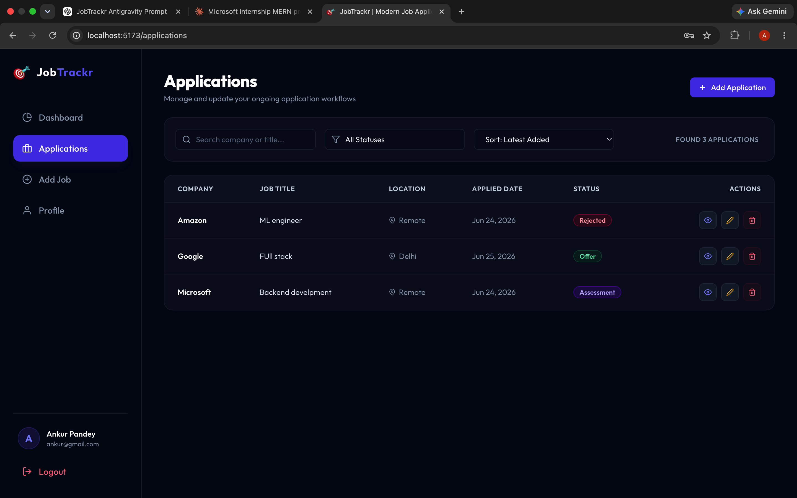
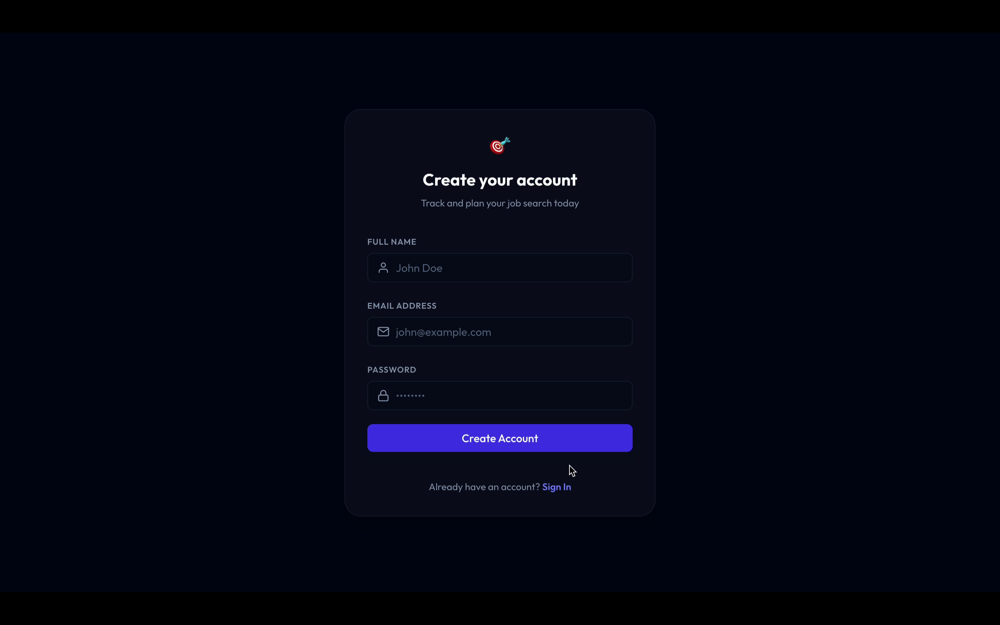
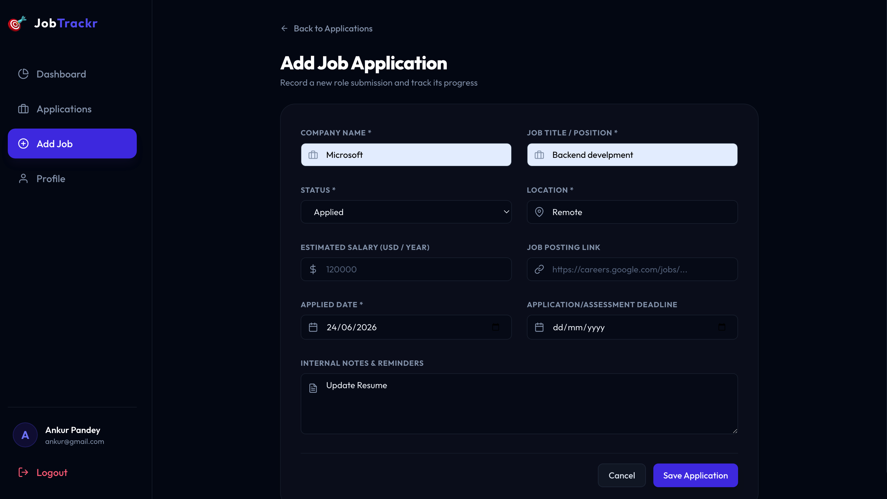

# 🎯 JobTrackr – Job Application Tracker

A full-stack MERN application that helps job seekers organize, track, and analyze their job applications throughout the hiring process.

## 📸 Project Preview

### Dashboard



### Applications Page



### Login Page



### Add Job Page



---

## 🚀 Features

* Secure JWT Authentication
* HTTP-only Cookie Sessions
* Job Application Management
* Status Tracking (Applied, Interview, Assessment, Offer, Rejected)
* Search, Filter & Sort Applications
* Pagination Support
* Analytics Dashboard
* Monthly Application Trends
* Success Rate Tracking
* Responsive Design
* Protected Routes
* Form Validation & Error Handling

---

## 🛠 Tech Stack

### Frontend

* React.js
* Vite
* React Router DOM
* Tailwind CSS
* React Hook Form
* Recharts
* Axios

### Backend

* Node.js
* Express.js

### Database

* MongoDB Atlas
* Mongoose

### Authentication

* JWT
* bcryptjs
* HTTP-only Cookies

---

## 📂 Project Structure

```text
jobtrackr-mern/
│
├── client/
├── server/
├── screenshot/
├── README.md
└── .gitignore
```

---

## ⚙️ Installation

### Clone Repository

```bash
git clone https://github.com/AnkurPandey1/jobtrackr-mern.git
cd jobtrackr-mern
```

### Backend Setup

```bash
cd server
npm install
npm run dev
```

### Frontend Setup

```bash
cd client
npm install
npm run dev
```

Application will run on:

```text
Frontend: http://localhost:5173
Backend:  http://localhost:5000
```

---

## 🔌 API Endpoints

### Authentication

* POST `/api/auth/register`
* POST `/api/auth/login`
* GET `/api/auth/logout`
* GET `/api/auth/current-user`

### Jobs

* GET `/api/jobs`
* POST `/api/jobs`
* GET `/api/jobs/:id`
* PATCH `/api/jobs/:id`
* DELETE `/api/jobs/:id`

### Stats

* GET `/api/stats`

---

## 📊 Dashboard Analytics

The dashboard provides:

* Total Applications
* Interviews Count
* Offers Count
* Rejections Count
* Monthly Application Trends
* Status Distribution
* Success Rate Percentage

Built using MongoDB Aggregation Pipelines and Recharts.

---

## 💼 Resume Highlights

* Built a full-stack CRUD application to track job applications across multiple hiring stages.
* Implemented JWT authentication with secure HTTP-only cookies and bcrypt password hashing.
* Developed analytics dashboards using MongoDB Aggregation Pipelines and Recharts.
* Created responsive UI with filtering, sorting, search, pagination, and form validation.

---

## 🚀 Future Improvements

* Email Reminders
* Interview Scheduling
* Resume Storage
* AI-Powered Resume Analysis
* Job Recommendation Engine

---

## 👨‍💻 Author

**Ankur Pandey**

⭐ If you found this project useful, consider starring the repository.
